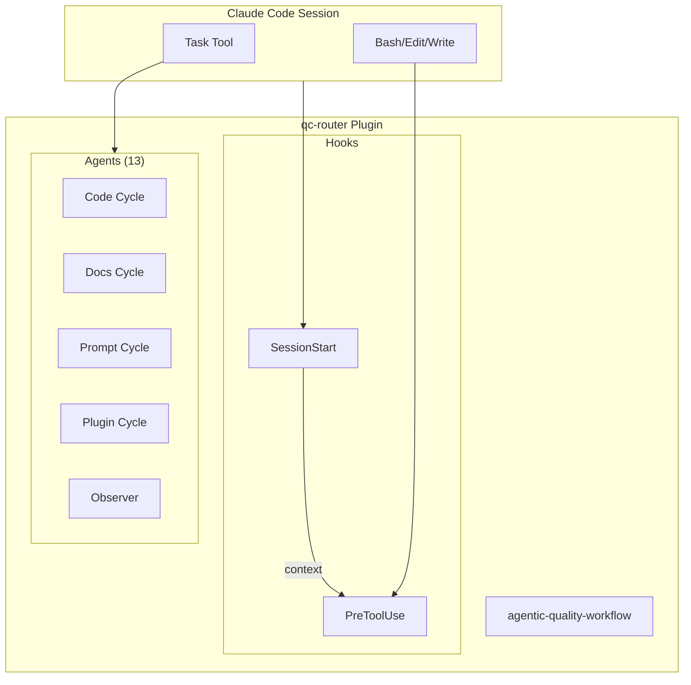

# ARCHITECTURE.md

Architecture overview for qc-router. For implementation details, see [DEVELOPER.md](DEVELOPER.md).

## Overview

qc-router enforces Creator/Critic/Judge quality cycles through three component types:

- **13 Agents** - Specialized Claude subagents for quality work
- **2 Hooks** - Shell scripts intercepting tool calls
- **1 Skill** - Procedural knowledge for quality workflows

## System Architecture



## Agent vs Hook Distinction

| Aspect | Agents | Hooks |
|--------|--------|-------|
| **Type** | Claude subagents | Shell scripts |
| **Invocation** | Task tool | Tool interception |
| **Purpose** | Perform quality work | Enforce rules |
| **Lifecycle** | On-demand | SessionStart, PreToolUse |

## Quality Cycles

| Cycle | Creator | Critic | Judge |
|-------|---------|--------|-------|
| R1 Code | code-developer | code-reviewer | code-tester |
| R2 Docs | tech-writer | tech-editor | tech-publisher |
| Prompt | prompt-engineer | prompt-reviewer | prompt-tester |
| Plugin | plugin-engineer | plugin-reviewer | plugin-tester |

Plus: **qc-observer** - Monitors quality cycle execution

## Integration with workflow-guard

qc-router provides agents with identity markers that workflow-guard detects:

```
Pattern: "working as the {agent-name} agent"
```

workflow-guard's `block-unreviewed-edits.sh` searches transcripts for these markers to allow file modifications only within quality cycles.

## Directory Structure

```
qc-router/
├── agents/{agent}/AGENT.md    # 13 agent definitions
├── hooks/
│   ├── hooks.json             # Hook configuration
│   ├── set-quality-cycle-context.sh
│   └── enforce-quality-cycle.sh
├── skills/agentic-quality-workflow/
│   ├── SKILL.md               # Overview
│   └── references/            # 12 detail documents
└── .claude-plugin/plugin.json # Plugin manifest
```
