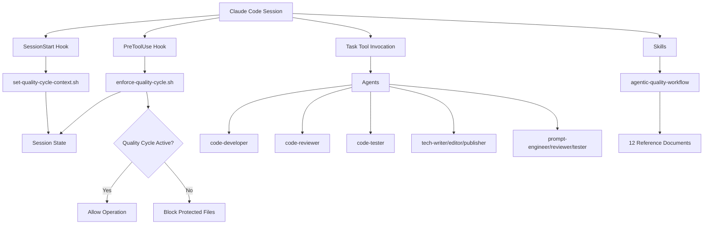
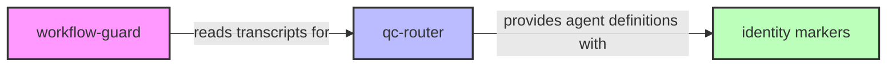
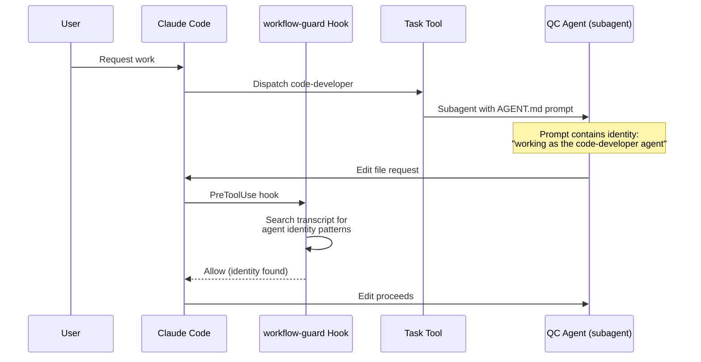

# DEVELOPER.md

Developer documentation for the QC Router Claude Code plugin.

## Overview

QC Router enforces Creator/Critic/Judge quality cycles through a plugin architecture combining agents, hooks, and skills. This document covers how to maintain, extend, and troubleshoot the plugin.

## Architecture



**Key Components:**

1. **Hooks** - Detect context and enforce quality cycle rules at session boundaries
2. **Agents** - Define specialized roles for Creator/Critic/Judge workflows
3. **Skills** - Provide procedural knowledge for worktree and quality workflows
4. **Session State** - Track quality cycle activation per session

## Plugin Manifest

File: `.claude-plugin/plugin.json`

```json
{
  "name": "qc-router",
  "version": "1.0.0",
  "agents": "./agents",
  "skills": "./skills",
  "hooks": "./hooks/hooks.json"
}
```

Claude Code reads this manifest to locate agents, skills, and hooks. The paths are relative to the plugin directory.

## Adding or Modifying Agents

### Agent Structure

Each agent lives in `agents/{agent-name}/AGENT.md` with YAML frontmatter:

```markdown
---
name: agent-name
description: One-line description of agent role
model: opus
invocation: Task tool with general-purpose subagent
---

# Agent-Name Agent

Detailed description...

## How to Invoke

Template for using the Task tool...

## Operating Principles

Core rules the agent follows...

## Working Loop

Step-by-step workflows...
```

### Frontmatter Fields

- **name**: Agent identifier (matches directory name)
- **description**: Short summary (used in listings)
- **model**: Recommended Claude model (opus, sonnet, haiku)
- **invocation**: How to invoke (typically "Task tool with general-purpose subagent")

### Required Sections

1. **How to Invoke** - Template prompt for Task tool
2. **Operating Principles** - Core guidelines (Start Clean, Ticket Operations, etc.)
3. **Working Loop** - Step-by-step procedures (Initial Implementation, Iteration)
4. **Quality Standards** or **Review Criteria** - Standards for judging work
5. **Anti-Patterns to Avoid** - Common mistakes
6. **Output Format** - Expected completion signals
7. **Usage Examples** - Concrete invocation examples

### Creating a New Agent

1. Create directory: `agents/{new-agent}/`
2. Create `AGENT.md` with frontmatter and required sections
3. **Include identity pattern** (see below)
4. Follow patterns from existing agents (code-developer is comprehensive)
5. Test by invoking via Task tool
6. **No restart needed** - agents are loaded dynamically

### Agent Identity Pattern (CRITICAL)

Every agent MUST include the identity pattern in its invocation template:

```markdown
You are a [descriptor] working as the {agent-name} agent in a quality cycle workflow.
```

This pattern is used by sister project workflow-guard to detect quality context. See [Sister Project: workflow-guard](#sister-project-workflow-guard) for details.

**Examples from existing agents:**

| Agent | Identity String |
|-------|-----------------|
| code-developer | "You are a pragmatic software developer working as the code-developer agent in a quality cycle workflow." |
| tech-writer | "You are a technical writer working as the tech-writer agent in a documentation quality cycle workflow." |
| plugin-engineer | "You are a pragmatic plugin developer working as the plugin-engineer agent in a quality cycle workflow." |

**Why this matters**: workflow-guard searches subagent transcripts for these identity strings. Without the pattern, the agent's file modifications will be blocked.

### Pattern: Creator Agents

Creator agents (code-developer, tech-writer, prompt-engineer) share:

- Ticket reading and updating
- Implementation loops
- Iteration based on feedback
- Commit after each todo
- Status updates: `critic_review` on completion

### Pattern: Critic Agents

Critic agents (code-reviewer, tech-editor, prompt-reviewer) share:

- Audit checklists with severity levels (CRITICAL/HIGH/MEDIUM)
- Objective, adversarial stance
- Specific, actionable findings
- No implementation work
- Status updates: `expediter_review` on completion

### Pattern: Judge Agents

Judge agents (code-tester, tech-publisher, prompt-tester) share:

- Automated validation where possible
- Final routing decisions (APPROVE/ROUTE_BACK/ESCALATE)
- Pragmatic thresholds
- Ticket movement to `completed/{branch}/` on approval

## Adding or Modifying Hooks

### Hook Configuration

File: `hooks/hooks.json`

```json
{
  "SessionStart": [
    {
      "hooks": [
        {
          "type": "command",
          "command": "hooks/set-quality-cycle-context.sh",
          "timeout": 10
        }
      ]
    }
  ],
  "PreToolUse": [
    {
      "matcher": "Bash|Edit|Write",
      "hooks": [
        {
          "type": "command",
          "command": "hooks/enforce-quality-cycle.sh",
          "timeout": 10
        }
      ]
    }
  ]
}
```

### Hook Types

Claude Code supports these hook triggers:

- **SessionStart** - Run when session begins
- **PreToolUse** - Run before tool execution (filtered by matcher regex)
- **PostToolUse** - Run after tool execution

### Hook Script Interface

Hooks receive JSON on stdin:

```json
{
  "tool_name": "Edit",
  "tool_input": {
    "file_path": "/path/to/file",
    "old_string": "...",
    "new_string": "..."
  },
  "session_id": "code-developer-abc123",
  "cwd": "/home/ddoyle/workspace/worktrees/project/branch"
}
```

Parse with `jq` (preferred) or regex fallback:

```bash
if command -v jq >/dev/null 2>&1; then
  tool_name=$(echo "${json_input}" | jq -r '.tool_name // ""')
else
  tool_name=$(echo "${json_input}" | grep -oP '"tool_name"\s*:\s*"\K[^"]+' || echo "")
fi
```

### Hook Exit Codes

- **0** - Allow operation to proceed
- **2** - Block operation with error message (stderr)
- **Non-zero (not 2)** - Internal error, operation may proceed

### Security Patterns

Both hooks implement security hardening:

1. **Path validation** - Use `realpath` to prevent traversal attacks
2. **Session ID validation** - Regex check for valid formats
3. **Command injection prevention** - Use `printf` instead of `echo`
4. **Atomic file operations** - Use `mktemp` and file locking
5. **Env file validation** - Restrict CLAUDE_ENV_FILE to safe locations

Example path validation:

```bash
validate_file_path() {
    local path="$1"
    if [[ "$path" =~ [$'\x00\n\r'] ]]; then
        return 1
    fi
    normalized_path=$(realpath --quiet --no-symlinks "$path" 2>/dev/null) || return 1
    echo "$normalized_path"
}
```

### Creating a New Hook

1. Write bash script in `hooks/{hook-name}.sh`
2. Add shebang: `#!/usr/bin/env bash`
3. Set strict mode: `set -euo pipefail`
4. Parse JSON input with jq/regex fallback
5. Implement security validations
6. Return appropriate exit code
7. Add to `hooks/hooks.json`
8. **Requires restart** to register hook configuration

## Adding or Modifying Skills

### Skill Structure

Skills use progressive disclosure pattern:

```
skills/
└── {skill-name}/
    ├── SKILL.md           # Overview with frontmatter
    └── references/
        ├── detail-1.md
        ├── detail-2.md
        └── detail-N.md
```

### SKILL.md Frontmatter

```markdown
---
name: skill-name
description: When and how to use this skill
---

# Skill Title

## Overview
Brief introduction (50-100 lines)

## Reference Materials
Links to detailed documents

[Detail Document](references/detail-1.md)
```

### Progressive Disclosure Approach

1. **SKILL.md** - Coarse-grained overview, when to use, quick start
2. **references/** - Fine-grained details, procedures, checklists
3. Users see overview first, dive into references as needed
4. Keep overview under 200 lines; move details to references

### Creating a New Skill

1. Create `skills/{skill-name}/` directory
2. Create `SKILL.md` with frontmatter and overview
3. Create `references/` directory
4. Write focused reference documents (50-200 lines each)
5. Link from SKILL.md with descriptions
6. **No restart needed** - skills loaded dynamically

## Testing Guide

### Testing Hooks

**Important**: Hooks require Claude Code restart to reload.

#### Manual Testing Process

1. Make changes to hook script
2. Restart Claude Code completely
3. Test with actual operations:

```bash
# Test SessionStart hook
# Start a new session and check logs
tail -f ~/.claude/logs/hooks-debug.log

# Test PreToolUse hook
# Try file operations and verify blocking/allowing
```

4. Check debug logs: `~/.claude/logs/hooks-debug.log`
5. Verify session state: `~/.claude/.session-state/{session-id}.files`

#### Testing Context Detection

```bash
# Simulate subagent context
export QUALITY_CYCLE_ACTIVE=true
# Attempt protected operation - should succeed

unset QUALITY_CYCLE_ACTIVE
# Attempt protected operation - should block
```

#### Testing Override

```bash
export CLAUDE_QC_OVERRIDE=true
# Protected operations should succeed with audit log
```

### Testing Agents

Agents don't require restart - test by invoking:

1. Create test ticket in `tickets/queue/`
2. Invoke agent via Task tool
3. Verify ticket updates and workflow
4. Check agent follows specified procedures

### Testing Skills

Skills load dynamically:

1. Modify skill content
2. Activate skill in new conversation
3. Verify references load correctly
4. Check progressive disclosure works

## Troubleshooting

### Hooks Not Working

**Symptom**: Hook doesn't execute or always allows operations

**Solutions**:
- Restart Claude Code (hooks cached at startup)
- Check `hooks/hooks.json` syntax (valid JSON)
- Verify script has execute permissions: `chmod +x hooks/*.sh`
- Check debug log: `~/.claude/logs/hooks-debug.log`

### Session State Issues

**Symptom**: Quality cycle context not detected

**Solutions**:
- Check `CLAUDE_ENV_FILE` is set and in safe location
- Verify session state directory exists: `~/.claude/.session-state/`
- Clean stale sessions: `find ~/.claude/.session-state/ -type f -mtime +1 -delete`

### Agent Not Found

**Symptom**: Task tool can't locate agent

**Solutions**:
- Verify agent directory exists: `~/.claude/plugins/qc-router/agents/{agent-name}/`
- Check AGENT.md has valid frontmatter
- Ensure frontmatter `name` matches directory name

### Hook Blocking Legitimate Operations

**Symptom**: Hook blocks work that should be allowed

**Solutions**:
- Use override: `export CLAUDE_QC_OVERRIDE=true` (emergency only)
- Check session context detection logic in `set-quality-cycle-context.sh`
- Verify session ID pattern matches expected format
- Add debug logging to understand detection failure

### Protected Path Not Blocking

**Symptom**: Hook allows modification of protected files

**Solutions**:
- Check `is_protected_path()` patterns in `enforce-quality-cycle.sh`
- Add specific patterns for new protected file types
- Verify path normalization with `realpath`

## Contribution Workflow

### Changes to Hooks

1. Create ticket: `tickets/queue/TICKET-qc-router-{seq}.md`
2. Invoke `code-developer` for implementation
3. Run through code-reviewer → code-tester quality cycle
4. Test manually with restart
5. Commit with semantic message: `feat(hooks): add validation for X`

### Changes to Agents

1. Create ticket describing agent changes
2. Invoke appropriate agent (likely tech-writer for documentation)
3. Test by invoking modified agent
4. Update related agents if workflow changes
5. Commit with: `docs(agents): update code-developer workflow`

### Changes to Skills

1. Determine if tech-writer needed (100+ lines = yes, R2 recipe)
2. Make changes following progressive disclosure pattern
3. Test skill activation and reference loading
4. Commit with: `docs(skills): add troubleshooting reference`

## Debug Logging

All hooks log to: `~/.claude/logs/hooks-debug.log`

Format: `[YYYY-MM-DD HH:MM:SS] [Hook] Message`

Enable verbose debugging by adding to hook scripts:

```bash
debug_log "Detailed state: var=$var, condition=$condition"
```

Tail logs during development:

```bash
tail -f ~/.claude/logs/hooks-debug.log
```

## File Locations Reference

| Component | Path |
|-----------|------|
| Plugin root | `~/.claude/plugins/qc-router/` |
| Manifest | `~/.claude/plugins/qc-router/.claude-plugin/plugin.json` |
| Agents | `~/.claude/plugins/qc-router/agents/{agent}/AGENT.md` |
| Hooks config | `~/.claude/plugins/qc-router/hooks/hooks.json` |
| Hook scripts | `~/.claude/plugins/qc-router/hooks/*.sh` |
| Skills | `~/.claude/plugins/qc-router/skills/{skill}/SKILL.md` |
| Debug logs | `~/.claude/logs/hooks-debug.log` |
| Session state | `~/.claude/.session-state/{session-id}.files` |

## Key Principles

1. **Hooks enforce, agents implement** - Hooks prevent rule violations, agents perform work
2. **Security first** - All inputs validated, no injection vulnerabilities
3. **Progressive disclosure** - Overview documents link to details, don't embed them
4. **Quality cycles mandatory** - All work goes through Creator/Critic/Judge
5. **Worktree isolation** - All development in dedicated worktrees, never on branches
6. **Ticket tracking** - All work tracked through project's ticket system

## Sister Project: workflow-guard

qc-router agents are used by workflow-guard to enforce quality cycle requirements. This is a critical integration that requires coordination when making changes.

### Dependency Direction



workflow-guard depends on qc-router's agent identity patterns. This is a one-way dependency:

- workflow-guard reads qc-router agent transcripts
- qc-router does not need workflow-guard to function
- Changes to qc-router agent identities can break workflow-guard

### Integration Mechanism



### Breaking Changes to Avoid

1. **Never remove the identity pattern** from AGENT.md invocation templates
   - Pattern: "working as the {agent-name} agent"
   - Location: Must be in the invocation template section

2. **Never rename agents** without coordinating with workflow-guard
   - workflow-guard maintains a list of recognized agent names
   - Renaming requires updating both projects

3. **Keep identity string early** in the prompt
   - workflow-guard searches the transcript
   - Earlier placement ensures detection

### Adding New Quality Agents

When adding new quality agents to qc-router:

1. **Include identity pattern in AGENT.md**
   ```markdown
   You are a [descriptor] working as the {new-agent-name} agent in a quality cycle workflow.
   ```

2. **Document the new agent**
   - Add to README.md agent tables
   - Update workflow-guard integration notes

3. **Coordinate with workflow-guard**
   - Add agent name to workflow-guard's recognized list
   - Test that workflow-guard allows the new agent's operations

4. **Test integration**
   - Verify agent identity appears in transcript
   - Verify workflow-guard recognizes and allows the agent

### Current Recognized Agents

| Cycle | Creator | Critic | Judge |
|-------|---------|--------|-------|
| Code | code-developer | code-reviewer | code-tester |
| Documentation | tech-writer | tech-editor | tech-publisher |
| Prompt | prompt-engineer | prompt-reviewer | prompt-tester |
| Plugin | plugin-engineer | plugin-reviewer | plugin-tester |

## Additional Resources

- [README.md](README.md) - User-facing overview and installation
- [agentic-quality-workflow skill](skills/agentic-quality-workflow/SKILL.md) - Worktree and quality cycle procedures
- [hooks/hooks.json](hooks/hooks.json) - Hook configuration reference
- [Code review checklists](skills/agentic-quality-workflow/references/code-review-checklists.md) - Critic and Judge criteria
