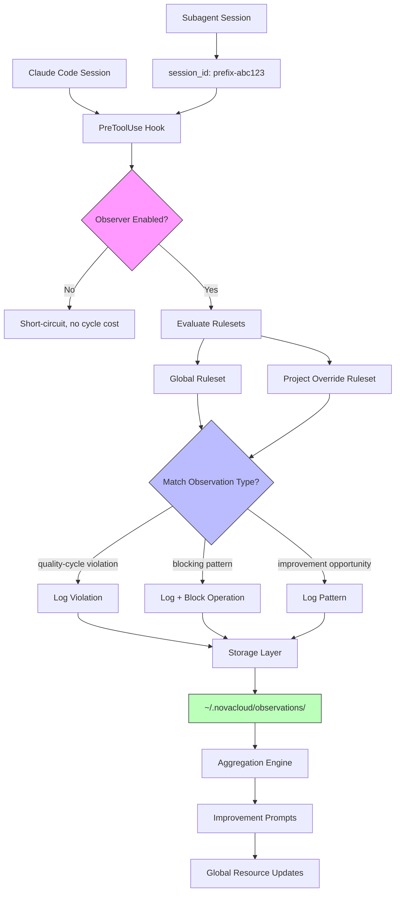

# QC Observer Use Cases

Use case documentation for the QC Observer system - optional improvement tooling for tracking quality patterns across projects.

## Overview

**QC Observer** is optional improvement tooling that tracks quality patterns, violations, and improvement opportunities across Claude Code sessions. Unlike integral infrastructure (like claude-mem), QC Observer can be added or removed without breaking core functionality.

### Key Differences from claude-mem

| Aspect | claude-mem | QC Observer |
|--------|-----------|-------------|
| **Purpose** | Integral infrastructure for knowledge storage/retrieval | Optional improvement tooling for quality pattern tracking |
| **Scope** | Store everything, query later | Track specific quality signals (violations, patterns) |
| **Model** | Raw tool I/O capture for knowledge replay | Ruleset-based observation with improvement prompts |
| **Dependency** | System can't work without it | Can be enabled/disabled per project or observation type |

### Observation Scopes

- **Global observations**: Cross-project patterns stored in `~/.novacloud/observations/`
- **Project-specific observations**: Local overrides and project-focused tracking
- **Session threading**: Subagents receive new session IDs with agent prefix (e.g., `code-developer-abc123`) that embed parent session ID for correlation

QC Observer improves global resources (qc-router, workflow-guard, ~/workspace/docs) by identifying patterns that emerge across multiple projects and sessions.

## Architecture



### Enable/Disable Model

Two operational modes (to be selected during implementation):

**Option 1: Enabled by Default**
- Observer runs for all sessions
- Short-circuits when observation rules don't match
- Zero cycle cost when no observations triggered
- Best for: Comprehensive pattern tracking

**Option 2: Disabled by Default**
- Observer activates based on observation type configuration
- Explicit enable per project or observation category
- Minimal overhead when not needed
- Best for: Selective quality tracking

### Storage Architecture

```
~/.novacloud/
├── observations/
│   ├── quality-cycle/          # Quality cycle violations
│   ├── blocking/               # Patterns that block operations
│   ├── patterns/               # Improvement opportunities
│   └── aggregations/           # Pattern summaries
└── observer-rules.json         # Global ruleset configuration
```

Project-specific overrides in `{project}/.qc-observer-rules.json`

### Session ID Threading

- Parent session: `session_id: abc123`
- Subagent sessions: `session_id: code-developer-abc123`, `tech-writer-abc123`
- All observations tagged with original session_id for correlation
- PreToolUse hook captures: tool_name, tool_input, session_id, conversation_id

## Work Cycles

QC Observer monitors four quality cycles and enforces/logs violations specific to each workflow.

### Coding Cycle (code-developer → code-reviewer → code-tester)

**What Observer Watches For:**
- Direct code changes outside quality cycle (Edit/Write without ticket activation)
- Ticket status progression violations (creator → critic → judge)
- Missing test coverage commitments
- Security violations in production code

**Violation Examples:**

```
Observation Type: blocking
Cycle: coding
Tool: Edit
File: src/auth.py
Violation: Direct modification outside quality cycle
Session: abc123
Agent: (none - main thread)
Action: BLOCKED
Message: Production code changes require code-developer agent
```

**Expected Output Format:**

```json
{
  "timestamp": "2025-12-07T14:30:00Z",
  "observation_type": "quality-cycle",
  "cycle": "coding",
  "session_id": "abc123",
  "agent": "code-developer-abc123",
  "tool": "Write",
  "file": "src/api.py",
  "violation": "Missing test coverage in implementation",
  "severity": "HIGH",
  "blocking": false,
  "context": {
    "ticket": "TICKET-api-refactor-001",
    "phase": "creator"
  }
}
```

**Blocking vs Logging:**
- **BLOCKING**: Direct code changes outside quality cycle
- **LOGGING**: Quality violations within approved cycles (review can address)

### Plugin Cycle (plugin-engineer → plugin-reviewer → plugin-tester)

**What Observer Watches For:**
- Hook modifications without plugin quality cycle
- Agent AGENT.md changes without testing
- Security regressions in hooks (path validation, injection prevention)
- Breaking changes to agent identity markers

**Violation Examples:**

```
Observation Type: blocking
Cycle: plugin
Tool: Edit
File: hooks/enforce-quality-cycle.sh
Violation: Hook modification outside plugin quality cycle
Session: def456
Agent: (none - main thread)
Action: BLOCKED
Message: Hook changes require plugin-engineer → plugin-reviewer → plugin-tester cycle
```

**Expected Output Format:**

```json
{
  "timestamp": "2025-12-07T15:00:00Z",
  "observation_type": "blocking",
  "cycle": "plugin",
  "session_id": "def456",
  "agent": null,
  "tool": "Edit",
  "file": "hooks/enforce-quality-cycle.sh",
  "violation": "Hook modification outside quality cycle",
  "severity": "CRITICAL",
  "blocking": true,
  "context": {
    "hook_type": "PreToolUse",
    "security_impact": true
  }
}
```

**Blocking vs Logging:**
- **BLOCKING**: Hook/agent modifications outside plugin cycle, security regressions
- **LOGGING**: Non-critical quality issues during plugin development

### Prompt Engineering Cycle (prompt-engineer → prompt-reviewer → prompt-tester)

**What Observer Watches For:**
- Agent AGENT.md modifications without prompt engineering cycle
- Handoff prompt quality violations (pillar methodology)
- Identity marker changes that break workflow-guard integration
- Prompt clarity/specificity regressions

**Violation Examples:**

```
Observation Type: quality-cycle
Cycle: prompt
Tool: Edit
File: agents/code-developer/AGENT.md
Violation: Agent prompt modified without prompt-reviewer check
Session: ghi789
Agent: plugin-engineer-ghi789
Action: LOGGED
Message: Prompt changes should go through prompt-reviewer for quality validation
```

**Expected Output Format:**

```json
{
  "timestamp": "2025-12-07T15:30:00Z",
  "observation_type": "quality-cycle",
  "cycle": "prompt",
  "session_id": "ghi789",
  "agent": "plugin-engineer-ghi789",
  "tool": "Edit",
  "file": "agents/code-developer/AGENT.md",
  "violation": "Prompt modification without prompt engineering cycle",
  "severity": "MEDIUM",
  "blocking": false,
  "context": {
    "pillar_coverage": "incomplete",
    "identity_marker_intact": true
  }
}
```

**Blocking vs Logging:**
- **BLOCKING**: Identity marker changes that break workflow-guard
- **LOGGING**: Quality improvements for prompts, pillar methodology adherence

### Tech Documentation Cycle (tech-writer → tech-editor → tech-publisher)

**What Observer Watches For:**
- Large documentation (100+ lines) created outside tech cycle
- 50-line artifact standard violations
- Missing Mermaid diagrams for complex flows
- Documentation inconsistencies with codebase

**Violation Examples:**

```
Observation Type: patterns
Cycle: tech
Tool: Write
File: docs/ARCHITECTURE.md
Violation: 200-line document created without tech-writer cycle
Session: jkl012
Agent: code-developer-jkl012
Action: LOGGED
Message: Documents >100 lines should use tech-writer → tech-editor → tech-publisher cycle
```

**Expected Output Format:**

```json
{
  "timestamp": "2025-12-07T16:00:00Z",
  "observation_type": "patterns",
  "cycle": "tech",
  "session_id": "jkl012",
  "agent": "code-developer-jkl012",
  "tool": "Write",
  "file": "docs/ARCHITECTURE.md",
  "violation": "Large documentation without tech cycle",
  "severity": "LOW",
  "blocking": false,
  "context": {
    "line_count": 200,
    "artifact_standard": "violated",
    "has_diagrams": false
  }
}
```

**Blocking vs Logging:**
- **BLOCKING**: None (documentation violations are advisory)
- **LOGGING**: All documentation quality violations for improvement tracking

## Ruleset Configuration

### Global Ruleset Structure

Located at `~/.novacloud/observer-rules.json`:

```json
{
  "version": "1.0.0",
  "enabled": true,
  "observation_types": {
    "quality-cycle": {
      "enabled": true,
      "severity_threshold": "MEDIUM",
      "cycles": ["coding", "plugin", "prompt", "tech"]
    },
    "blocking": {
      "enabled": true,
      "patterns": [
        "hook_modification_outside_cycle",
        "security_regression",
        "identity_marker_removal"
      ]
    },
    "patterns": {
      "enabled": true,
      "aggregation_threshold": 3,
      "improvement_prompt_frequency": "weekly"
    }
  },
  "cycles": {
    "coding": {
      "watch_tools": ["Edit", "Write"],
      "protected_patterns": ["src/**/*.py", "src/**/*.ts"],
      "require_ticket": true
    },
    "plugin": {
      "watch_tools": ["Edit", "Write"],
      "protected_patterns": ["hooks/**/*", "agents/**/AGENT.md"],
      "require_quality_cycle": true
    },
    "prompt": {
      "watch_tools": ["Edit", "Write"],
      "protected_patterns": ["agents/**/AGENT.md"],
      "pillar_methodology": true
    },
    "tech": {
      "watch_tools": ["Write"],
      "line_threshold": 100,
      "artifact_standard": 50
    }
  }
}
```

### Per-Project Overrides

Located at `{project}/.qc-observer-rules.json`:

```json
{
  "extends": "~/.novacloud/observer-rules.json",
  "overrides": {
    "observation_types": {
      "quality-cycle": {
        "enabled": false
      }
    },
    "cycles": {
      "coding": {
        "protected_patterns": ["lib/**/*.rs", "src/**/*.rs"]
      }
    }
  }
}
```

**Observation Type Categories:**
- **quality-cycle**: Violations of Creator/Critic/Judge workflow
- **blocking**: Patterns that prevent operations (security, breaking changes)
- **patterns**: Improvement opportunities that aggregate into prompts

## Expected Outputs

### Observation Record Format

All observations stored as JSON with consistent schema:

```json
{
  "timestamp": "ISO-8601",
  "observation_type": "quality-cycle | blocking | patterns",
  "cycle": "coding | plugin | prompt | tech",
  "session_id": "original-session-id",
  "agent": "agent-name-session-id | null",
  "tool": "Bash | Edit | Write | NotebookEdit",
  "file": "absolute-path-to-file",
  "violation": "human-readable-description",
  "severity": "CRITICAL | HIGH | MEDIUM | LOW",
  "blocking": true | false,
  "context": {
    "cycle-specific-metadata": "varies-by-cycle"
  }
}
```

### Improvement Prompt Generation

When patterns aggregate (threshold: 3 occurrences), QC Observer generates improvement prompts:

```markdown
# Improvement Prompt: Large Documentation Outside Tech Cycle

## Pattern Detected
- Occurrences: 5
- Sessions: abc123, def456, ghi789, jkl012, mno345
- Files: docs/ARCHITECTURE.md, docs/API.md, README.md, DEVELOPER.md, docs/GUIDE.md

## Observations
All instances created documentation >100 lines outside tech-writer cycle.

## Recommendation
Update CLAUDE.md or developer documentation to remind agents:
- Documents >100 lines should use R2 recipe (tech-writer → tech-editor → tech-publisher)
- Consider breaking large docs into focused sections (50-line artifact standard)

## Proposed Action
Add to project CLAUDE.md:
```
**Documentation Standards:**
- Documents >100 lines require tech-writer cycle (R2 recipe)
- Follow 50-line artifact standard (break into focused sections)
```

## Session Context
- Pattern frequency: Weekly
- Projects affected: qc-router, workflow-guard, workspace/docs
```

### Pattern Aggregation

Aggregation engine groups observations by:
- **Violation type** (quality-cycle, blocking, patterns)
- **Cycle** (coding, plugin, prompt, tech)
- **Frequency** (daily, weekly, monthly)
- **Projects** (cross-project patterns vs project-specific)

Aggregated patterns stored in `~/.novacloud/observations/aggregations/` with weekly/monthly summaries used to update global resources (CLAUDE.md files, documentation, agent prompts).

---

**Document Status:** Created by tech-writer | Next: tech-editor review

**Related Documentation:**
- [README.md](../README.md) - Plugin overview
- [DEVELOPER.md](../DEVELOPER.md) - Technical architecture
- [CLAUDE.md](../CLAUDE.md) - Project context and rules
- [hooks/](../hooks/) - Hook implementation reference
