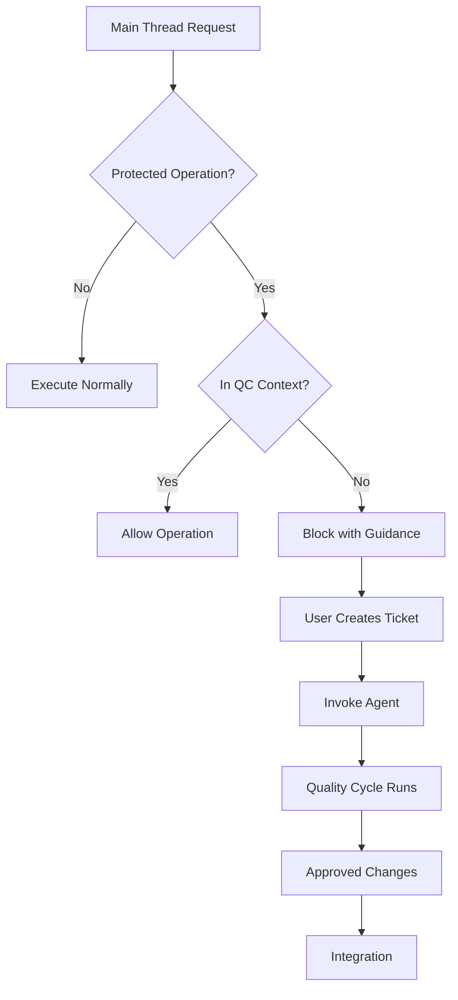

# Quality Cycle Enforcement Guide

## Overview

This guide explains the hook-based enforcement mechanism that ensures quality cycles are used for operations requiring review. The system actively BLOCKS certain operations when not in a proper quality cycle context.

## How Enforcement Works

### 1. PreToolUse Hook (`enforce-quality-cycle.sh`)

**Triggers on:** Bash, Edit, Write tool invocations

**Blocks operations involving:**

- Bash scripts (`.sh` files, `/scripts/`, `/hooks/`)
- Agent definitions (`/.claude/agents/*/AGENT.md`)
- Skills (`/.claude/skills/`)
- Security-sensitive code

**How it works:**

1. Receives tool invocation details via stdin (JSON)
2. Checks if operation matches protected patterns
3. Verifies quality cycle context via CLAUDE_ENV_FILE
4. Blocks with exit code 2 if requirements not met
5. Provides clear error message with guidance

### 2. SessionStart Hook (`set-quality-cycle-context.sh`)

**Triggers on:** Session initialization

**Sets context when detecting:**

- Subagent session IDs (code-developer-, code-reviewer-, etc.)
- Worktree working directories
- Ticket-based work patterns
- Explicit quality cycle mode

**How it works:**

1. Analyzes session metadata
2. Detects quality cycle indicators
3. Sets `QUALITY_CYCLE_ACTIVE=true` in CLAUDE_ENV_FILE
4. Clears stale context in main thread sessions

## Protected Operations

### Bash Scripts

- Any command creating/modifying `.sh` files
- Operations in `/scripts/` directories
- Hook script modifications

### Agent Definitions

- Edits to `AGENT.md` files
- Agent configuration changes
- Agent behavior modifications

### Skills

- Any modifications in `/.claude/skills/`
- Skill definitions and references
- Skill configuration files

## Quality Cycle Context Detection

### Automatic Detection

The system automatically detects quality cycle context through:

1. **Session ID patterns:**

   - `code-developer-*`
   - `code-reviewer-*`
   - `code-tester-*`
   - `tech-writer-*`

2. **Working directory patterns:**

   - `/workspace/worktrees/*` paths
   - Project-specific worktree locations

3. **Ticket patterns:**

   - `TICKET-*` in session ID
   - Active ticket work indicators

4. **Environment markers:**
   - `QUALITY_CYCLE_MODE=true`
   - CLAUDE_ENV_FILE markers

### Manual Context Setting

For special cases, context can be manually set:

```bash
# Set in CLAUDE_ENV_FILE
echo "QUALITY_CYCLE_ACTIVE=true" >> "$CLAUDE_ENV_FILE"
```

## Emergency Override

For legitimate exceptions where quality cycles cannot be used:

```bash
# Enable override for current operation
export CLAUDE_QC_OVERRIDE=true

# Perform the operation
# ... your commands ...

# Disable override (recommended)
unset CLAUDE_QC_OVERRIDE
```

**Use sparingly!** Overrides bypass important safety checks.

## Error Messages and Recovery

### When Blocked

You'll see a detailed error message:

```
━━━━━━━━━━━━━━━━━━━━━━━━━━━━━━━━━━━━━━━━━━━━━━━━━━━━━━━━━━━━
❌ QUALITY CYCLE REQUIRED - Operation Blocked
━━━━━━━━━━━━━━━━━━━━━━━━━━━━━━━━━━━━━━━━━━━━━━━━━━━━━━━━━━━━

Reason: Bash script creation/modification requires quality cycle
Tool: Bash
Target: create-backup.sh

TO PROCEED CORRECTLY:
1. Create a ticket: tickets/active/{branch}/TICKET-{session-id}-{seq}.md
2. Use the appropriate agent via Task tool
3. Let the quality cycle run (Creator → Critic → Expediter)
```

### Recovery Steps

1. **Create a ticket** with requirements
2. **Invoke the appropriate agent:**
   - Code work: `code-developer`
   - Documentation: `tech-writer`
3. **Let the cycle complete** through all phases
4. **Integrate approved changes** back to main

## Debugging

### Check Current Context

```bash
# View environment file
cat "$CLAUDE_ENV_FILE"

# Check for quality cycle markers
grep "QUALITY_CYCLE" "$CLAUDE_ENV_FILE"
```

### View Hook Logs

```bash
# Hook debug logs
tail -f ~/.claude/logs/hooks-debug.log

# Session state tracking
ls ~/.claude/.session-state/
```

### Test Hook Behavior

```bash
# Test with sample input
echo '{"tool_name":"Bash","tool_input":{"command":"edit script.sh"},"session_id":"test-123"}' | ~/.claude/hooks/enforce-quality-cycle.sh
```

## Configuration

### Hook Settings

Located in `~/.claude/settings.json`:

```json
{
  "hooks": {
    "PreToolUse": [
      {
        "matcher": "Bash",
        "hooks": [
          {
            "type": "command",
            "command": "~/.claude/hooks/enforce-quality-cycle.sh",
            "timeout": 3
          }
        ]
      }
      // ... Edit, Write matchers
    ],
    "SessionStart": [
      {
        "hooks": [
          {
            "type": "command",
            "command": "~/.claude/hooks/set-quality-cycle-context.sh",
            "timeout": 2
          }
        ]
      }
    ]
  }
}
```

### Disabling Hooks Temporarily

For bootstrap or emergency situations:

```json
{
  "disableAllHooks": false
  // ... rest of config
}
```

Remove `disableAllHooks` or set to `false` to re-enable enforcement.

### Timeout Configuration

- PreToolUse: 3 seconds (blocking operations)
- SessionStart: 2 seconds (context setting)

## Common Issues

### False Positives

**Issue:** Legitimate operations blocked incorrectly

**Solution:**

1. Check if operation truly requires quality cycle
2. Use emergency override if justified
3. Report pattern to improve detection

### Context Not Set

**Issue:** Subagent operations blocked

**Solution:**

1. Verify SessionStart hook is enabled
2. Check CLAUDE_ENV_FILE is writable
3. Review session ID patterns

### Performance Impact

**Issue:** Hook adds latency to operations

**Solution:**

1. Hooks use efficient pattern matching
2. Timeout limits prevent hanging
3. Debug logs help identify bottlenecks

### Bootstrap Problem

**Issue:** Hooks block their own setup

**Solution:**

1. Temporarily set `disableAllHooks: true` in settings.json
2. Complete implementation
3. Re-enable hooks by removing/setting to false

## Best Practices

### For Users

1. **Understand the requirements** - Know which operations need quality cycles
2. **Plan ahead** - Create tickets before starting protected work
3. **Use proper workflow** - Follow Creator → Critic → Expediter cycle
4. **Avoid overrides** - Emergency override should be rare

### For Developers

1. **Test thoroughly** - Ensure hooks don't break normal operations
2. **Clear messages** - Error messages should guide to solution
3. **Fast execution** - Hooks should complete quickly
4. **Robust patterns** - Avoid false positives/negatives

## Integration with Quality Cycles

### Workflow Integration



### Enforcement Points

1. **Pre-execution:** Hooks check before tool runs
2. **Context aware:** Automatic detection of quality cycles
3. **Graceful blocking:** Clear messages, not silent failures
4. **Override available:** Emergency escape hatch exists

## Security Considerations

### Hook Security

- Scripts run with user privileges
- Input validation prevents injection
- Absolute paths avoid path traversal
- Variables properly quoted

### Override Security

- Override requires explicit environment variable
- Not persistent across sessions
- Logged for audit purposes
- Should trigger review if overused

## Future Enhancements

### Planned Improvements

1. **Pattern refinement** - Better detection of protected operations
2. **Context persistence** - Improved state management across sessions
3. **Audit logging** - Track all blocked operations and overrides
4. **Performance optimization** - Faster pattern matching
5. **User feedback** - Collect data on false positives/negatives

### Extension Points

- Additional protected patterns
- Custom enforcement rules
- Integration with other tools
- Reporting and metrics

## Summary

The enforcement mechanism ensures quality cycles are used when required, preventing security issues and maintaining code quality. It operates transparently in proper contexts while blocking and guiding when requirements aren't met.

Key takeaways:

- **Automatic enforcement** prevents accidental violations
- **Clear guidance** helps users follow proper workflow
- **Context awareness** allows seamless operation in quality cycles
- **Emergency override** provides escape hatch when needed
- **Continuous improvement** through logging and feedback
